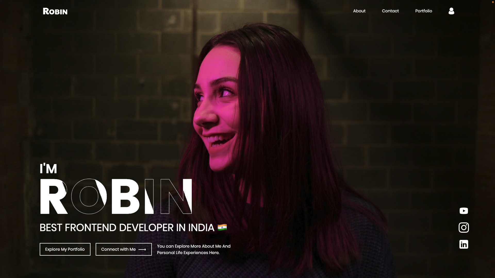

# Website With Animated Text Effect Using HTML And CSS

A website with an animated text effect using HTML and CSS can enhance the visual appeal and engagement of a web page. By incorporating dynamic text animations, such as fading, sliding, or scaling effects, the website can create a captivating and modern user experience. HTML provides the structure and content of the webpage, while CSS is utilized to define the style and layout, including the animation effects. This combination allows for the creation of visually striking text elements that can dynamically change, transition, or react to user interactions, thereby adding a sense of dynamism and interactivity to the website. These animated text effects can be employed for various purposes, including highlighting key messages, drawing attention to specific content, or creating an overall immersive and aesthetically pleasing user interface. By leveraging these techniques, web developers can elevate the visual storytelling and impact of a website, making it more engaging and memorable for visitors.

